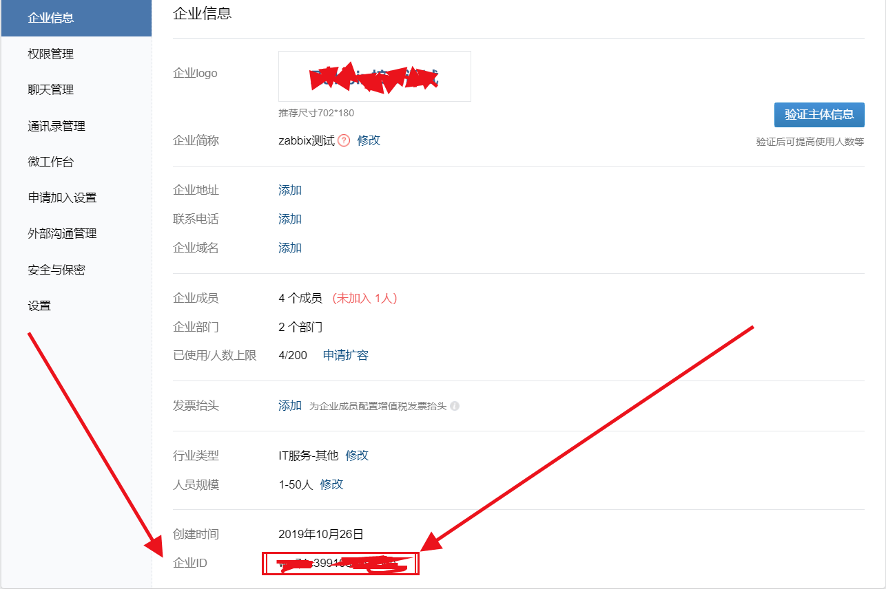
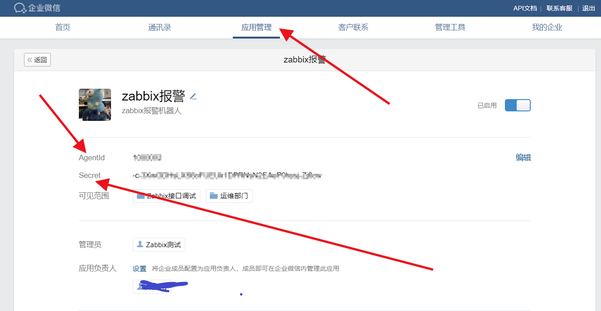
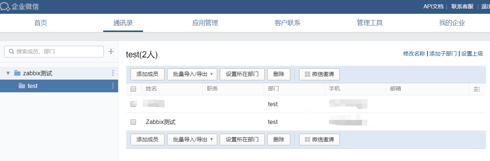
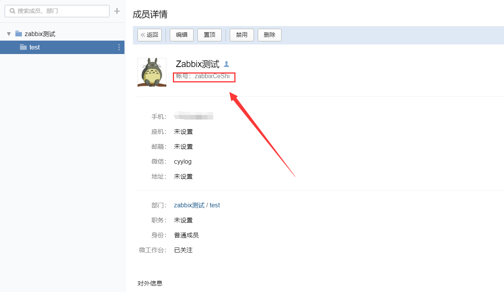
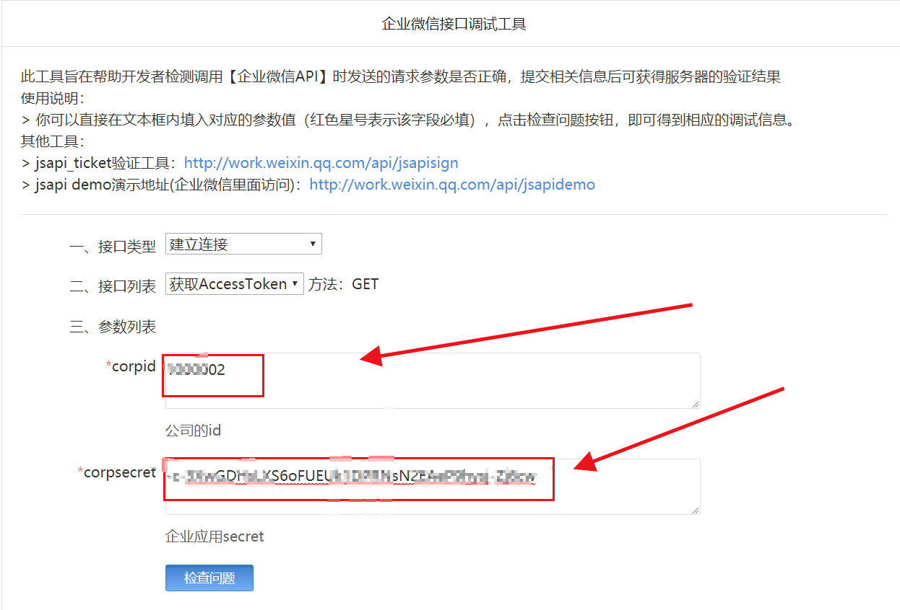
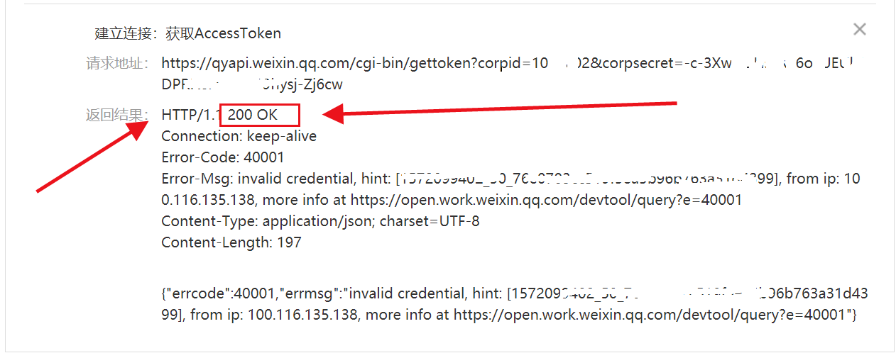
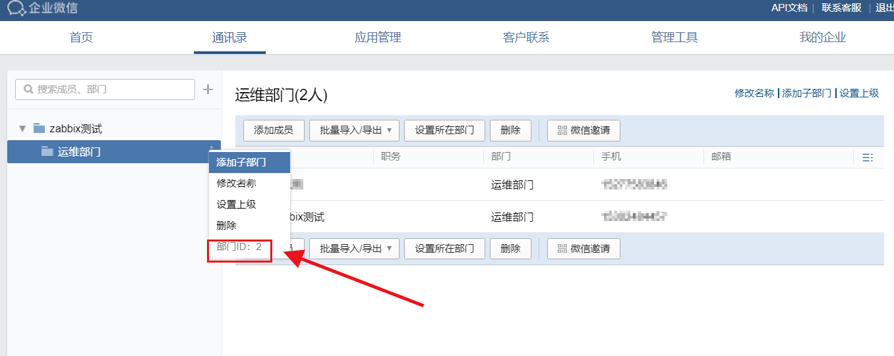
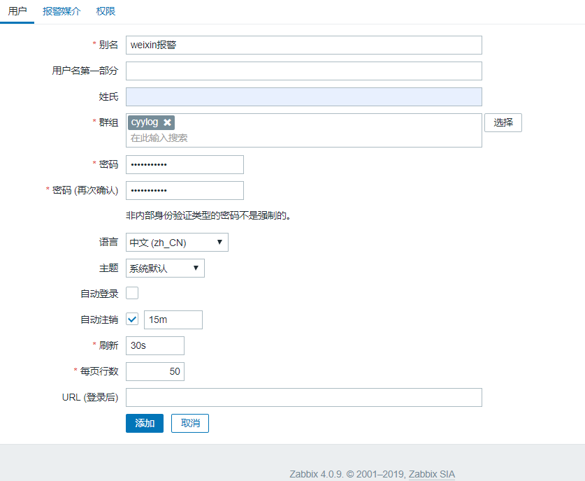
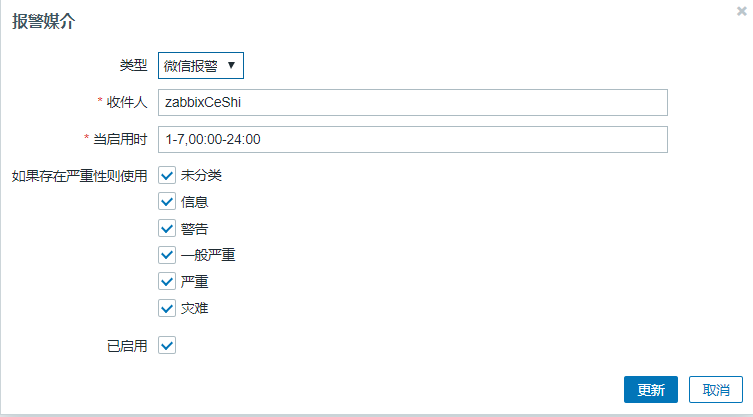

# zabbix 微信报警设置

### 一、主要获取三个参数:企业ID、用户账号、AgentId,和Secret：

##### 1.获取企业ID




##### 2.获取AgentId,和Secret3

这里要先点通讯录创建一个部门，然后再点应用小程序创建应用，填写logo、名称、和选择部门就可以了





##### 3.获取用户账号






##### 4.测试gentId,和Secret


这个是接口调用测试gentId,和Secret的地址：<https://work.weixin.qq.com/api/devtools/devtool.php>

这里看到有HTTP/1.1 200 OK 就说明接口有效了，其它的不管。







### 二、调用的shell脚本方式，脚本如下：


##### 这里要注意的是填写正确的通讯录 部门ID，可以点那个下线三个点那里。





```shell
[root@cyy alertscripts]# vim wechat.sh


#!/usr/bin/env bash
#!/usr/bin/env bash
#
# Author: cyylog
# Email: cyylog@aliyun.com
# Date: 2019/09/25
# Github:	https://github.com/cyylog
# Usage:	Wechat alert script for zabbix
# 

if [ $# -eq 0 ] || [[ "$1" == "-h" || "$1" == "--help" ]];then
        echo "Usage of $0:"
        echo -e " --CorpID=string"
        echo -e " --Secret=string"
        echo -e " --AgentID=string"
        echo -e " --UserID=string"
        echo -e " --Msg=string"
        exit
fi

#ops=(-c -s -a -u)
#args=(CorpID Secret AgentID UserID)
#while [ $# -gt 0 ];do
#    [ "$1" == "-m" ] && Msg="$2" && shift 2
#    for i in {0..3};do
#        [ "$1" == "${ops[i]}" ] &&  eval ${args[i]}="$2"
#    done
#    shift 2
#done
for i in "$@";do
        echo $i|grep Msg &> /dev/null && msg=$(echo $i|sed 's/.*=//') && Msg="$msg" && continue
        eval "$(echo $i|sed 's/--//')"
done
#echo $CorpID
#echo $Secret
#echo $UserID
#echo $AgentID
#echo $Msg
#
GURL="https://qyapi.weixin.qq.com/cgi-bin/gettoken?corpid=$CorpID&corpsecret=$Secret"
Token=$(/usr/bin/curl -s -G $GURL |awk -F \" '{print $10}')
PURL="https://qyapi.weixin.qq.com/cgi-bin/message/send?access_token=$Token"
Info(){
        printf '{\n'
        printf '\t"touser": "'"$UserID"\"",\n"
        printf '\t"msgtype": "text",\n'
        printf '\t"agentid": "'"$AgentID"\"",\n"
        printf '\t"text": {\n'
        printf '\t\t"content": "'"$Msg"\""\n"
        printf '\t},\n'
        printf '\t"safe":"0"\n'
        printf '}\n'
}

/usr/bin/curl --data-ascii "$(Info)" $PURL
echo

           


[root@cyy alertscripts]# chmod +x wechat.sh

[root@cyy alertscripts]# ./wechat.sh  "这里一个测试"     //可以这样直接调试，然后登陆到企业微信查看该部门的群成员是否收到此信息

脚本测试通过后就是在zabbix控制台上设置了
```


### 三、zabbix 控制台添加新媒体

##### 1.点管理 -> 报警媒介类型 -> 创建媒介类型


```shell
--AgentID=1000002

--CorpID=ww74c********56c	

--Secret=-c-3Xw*****************j-Zj6cw

--Msg={ALERT.MESSAGE}

--UserID={ALERT.SENDTO}
```

##### 2.然后再设置上用户：点管理 —> 创建用户（微信报警的用户）




#####  3.再点用户旁边的 报警媒介 进行设置（收件人要填写用户的账号）

**第一步的第3点获取的账号**





###### 到这里就基本都设置完成了，可以设置个触发器和动作来测试脚本。